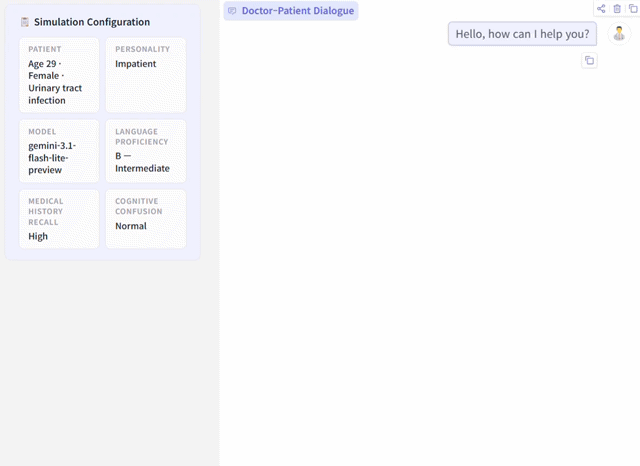

# PatientSim: A Persona-Driven Simulator for Realistic Doctor-Patient Interactions 
<a href="https://dek924.github.io/"> Daeun Kyung</a>,
<a href="https://sites.google.com/view/thschung"> Hyunseung Chung</a>,
<a href="https://seongsubae.info/"> Seongsu Bae</a>,
<a href="https://jiho283.github.io/"> Jiho Kim</a>,
<a href="https://radiology.ucsf.edu/people/jae-ho-sohn"> Jae Ho Sohn</a>,
<a href="https://smarthealthlab.skku.edu/taerim-kim/"> Taerim Kim</a>,
<a href="https://sites.google.com/view/soo-kyung-kim/home?authuser=0"> Soo Kyung Kim*</a>,
<a href="https://mp2893.com/"> Edward Choi*</a>
<br>
<a href="https://neurips.cc/"> NeurIPS 2025 Datasets & Benchmarks Track (Spotlight) </a>

## Overview
Doctor-patient consultations require multi-turn, context-aware communication tailored to diverse patient personas. 
Training or evaluating doctor LLMs in such settings requires realistic patient interaction systems. However, existing simulators often fail to reflect the full range of personas seen in clinical practice. 
To address this, we introduce PatientSim, a patient simulator that generates realistic and diverse patient personas for clinical scenarios, grounded in medical expertise.
PatientSim operates using: 1) clinical profiles, including symptoms and medical history, derived from real-world data in the MIMIC-ED and MIMIC-IV datasets, and 2) personas defined by four axes: personality, language proficiency, medical history recall level, and cognitive confusion level, resulting in 37 unique combinations.
We evaluated eight LLMs for factual accuracy and persona consistency. 
The top-performing open-source model, Llama 3.3, was validated by four clinicians to confirm the robustness of our framework.
As an open-source, customizable platform, PatientSim provides a reproducible and scalable solution that can be customized for specific training needs. 
Offering a privacy-compliant environment, it serves as a robust testbed for evaluating medical dialogue systems across diverse patient presentations and shows promise as an educational tool for healthcare.
 

<br />

## Updates
- [03/31/2026] We released an interactive [demo](https://huggingface.co/spaces/dek924/PatientSim) for PatientSim on HuggingFace Spaces.
- [10/18/2025] We released [PatientSim](https://physionet.org/content/persona-patientsim/1.0.0/) dataset on PhysioNet.
- [08/21/2025] We released the official Python package of our simulator: [patientsim](https://pypi.org/project/patientsim).
- [05/23/2025] We released our research paper on [arXiv](https://www.arxiv.org/abs/2505.17818).

<br />

## Demo
- The interactive demo is available on HuggingFace Spaces. It uses a synthetic patient profile generated by GPT-5. No credentials required. Try it now! ([link](https://huggingface.co/spaces/dek924/PatientSim))

  


## Dataset
### Download
- The dataset is available through PhysioNet and requires a credentialed PhysioNet account ([link](https://physionet.org/content/persona-patientsim/1.0.0/)). 
- Unzip the dataset in the `./src/data/final_data` folder, which is the default path for the PatientSim experiment.

### Data Preprocessing
- Details of our data preprocessing process can be found in [`prepare_datasets.md`](src/data_preprocessing/prepare_datasets.md).

<br />

## Environment
### Installation
For Linux systems, ensure Python 3.11 or higher is installed. Then, set up the environment and install dependencies:
```
# Set up the environment
conda create -n patientsim python=3.11

# Activate the environment
conda activate patientsim

# Install required packages
pip install -r requirements.txt
```

### API Setup
Set API credentials depending on which provider you’re using. 
Note that since our patient profile is based on MIMIC database, which requires PhysioNet credentials, only Vertex AI (Gemini) or Azure OpenAI (GPT) are supported (per PhysioNet’s instructions).
> [!NOTE]
> To use Vertex AI, you must complete the following setup steps:
> 1) Select or create a Google Cloud project in the Google Cloud Console.
> 2) Enable the Vertex AI API.
> 3) Generate a Vertex AI Express Mode API key and set its value in the `GENAI_API_KEY` environment variable.

```
# For GPT API with Azure
export OPENAI_API_KEY="YOUR_OPENAI_API_KEY"
export AZURE_OPENAI_KEY="YOUR_AZURE_OPENAI_KEY"
export AZURE_ENDPOINT="YOUR_AZURE_ENDPOINT"

# For Gemini API with Vertex AI
export GENAI_API_KEY="YOUR_API_KEY"
export GOOGLE_GENAI_USE_VERTEXAI="True"

# For vLLM serving model
export VLLM_PORT="YOUR_VLLM_PORT"
```

### vLLM setting
Start the vLLM server:
```
python -m vllm.entrypoints.openai.api_server \
    --model meta-llama/Llama-3.3-70B-Instruct \ # change the model name 
    --load-format safetensors \
    --max-model-len 9182 \
    --port VLLM_PORT
```

<br />


## Running the Simulation

### Default Settings
To run a simulation with default persona and hyperparameters:
```
cd src
python run_simulation.py \
    --config-name base \
    experiment.exp_name "YOUR_EXP_NAME" \
    experiment.verbose true \
    doctor_agent.api_type=gpt_azure \
    doctor_agent.backend=gpt-4o-mini \
    patient_agent.api_type=vllm \
    patient_agent.backend=vllm-llama3.3-70b-instruct \
    patient_agent.params.temperature=0.7 \
```
**Note**: Adjust LLM backbones as needed. Default hyperparameters are based on the paper's experiments.


### Custom Persona Settings (Optional)
To customize the patient persona, use the following:
```
cd src
python run_simulation.py \
    --config-name base \
    experiment.exp_name "YOUR_EXP_NAME" \
    experiment.verbose true \
    doctor_agent.api_type=gpt_azure \
    doctor_agent.backend=gpt-4o-mini \
    patient_agent.api_type=vllm \
    patient_agent.backend=vllm-llama3.3-70b-instruct \
    patient_agent.params.temperature=0.7 \
    patient_agent.persona.cefr_type=$cefr_type \
    patient_agent.persona.personality_type=$personality_type \
    patient_agent.persona.recall_level_option=$recall_type \
    patient_agent.persona.dazed_level_option=$dazed_type \
```
**Note**: Adjust persona types and LLM backbones as needed.

<br />

## Evaluation
### Dialog-Level Evaluation
Evaluate generated dialogues for persona fidelity, profile consistency, or differential diagnosis (DDx):
```
cd src
python ./eval/llm_eval.py \
    --trg_exp_name "${trg_exp_name}"  \
    --moderator gemini-2.5-flash  \
    --moderator_api_type genai  \
    --eval_persona_quality  
```
**Flags**:
- `--eval_persona_quality`: Evaluate persona fidelity.
- `--eval_profile_consistency`: Evaluate profile consistency/coverage.
- `--eval_ddx`: Evaluate differential diagnosis.

### Sentence-level evaluation 
Evaluate generated dialogues at the sentence level:
```
cd src
python ./eval/llm_eval_NLI_batch.py \
    --trg_exp_name "${trg_exp_name}" \
    --moderator gemini-2.5-flash \
    --eval_target all \
    --moderator_api_type genai
```

<br />

## Demo
You can quickly try out PatientSim using `demo/demo.py`.
See [`how_to_use_demo.md`](demo/how_to_use_demo.md) for detailed instructions.

<br />

## Citation
```
@inproceedings{
    kyung2025patientsim,
    title={PatientSim: A Persona-Driven Simulator for Realistic Doctor-Patient Interactions},
    author={Daeun Kyung and Hyunseung Chung and Seongsu Bae and Jiho Kim and Jae Ho Sohn and Taerim Kim and Soo Kyung Kim and Edward Choi},
    booktitle={The Thirty-ninth Annual Conference on Neural Information Processing Systems Datasets and Benchmarks Track},
    year={2025},
    url={https://openreview.net/forum?id=1THAjdP4QJ}
}
```

<br />

## Contact
For any questions or concerns regarding this code, please contact to us ([kyungdaeun@kaist.ac.kr](mailto:kyungdaeun@kaist.ac.kr)).
